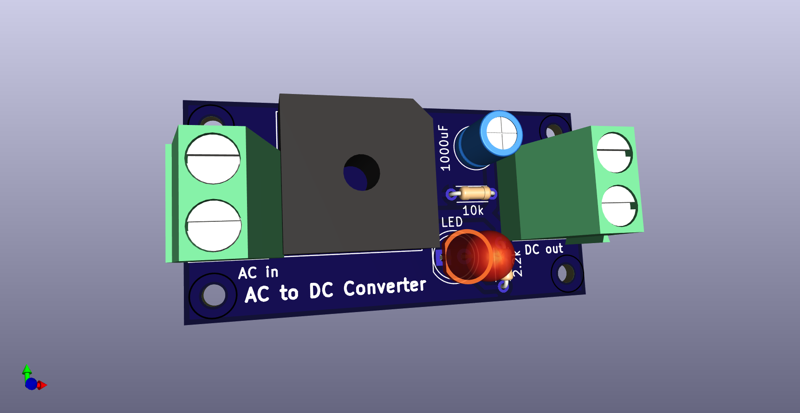

# AC to DC Converter Circuit

## Overview

This project demonstrates a **230V AC to 12V DC converter** circuit that steps down the high-voltage AC input and provides a stable DC output using a step-down transformer, full-wave rectifier bridge, smoothing capacitor, and a **LM7812 voltage regulator**. The circuit is designed to convert AC mains power into a smooth 12V DC signal for low-voltage applications.
## Simulation with Proteus 

## Schematic and PCB Layout

- The circuit begins with a **230V to 12V step-down transformer** to reduce the AC voltage to a more manageable level.
- A **full-wave rectifier bridge** formed by **four diodes (D1, D2, D3, D4)** converts the 12V AC signal into a **pulsating DC voltage**.
- A **filter capacitor (C1, 1000µF)** is used to smooth the rectified DC signal, reducing any ripple.
- A **LM7812 voltage regulator** is then used to regulate the DC output to a steady 12V DC, ensuring stable voltage even with input fluctuations.
- The circuit includes an **LED indicator (D5)** with a **current-limiting resistor (R1, 2.2kΩ)** to show when the circuit is powered and functioning.
- The **AC input** is connected via the screw terminals labeled **J1** (AC In), and the **DC output** is available at the screw terminals labeled **J2** (DC Out).
- Additional resistors such as **R2 (10kΩ)** provide other functionality within the circuit, such as load balancing or voltage division.

### Upgraded Components:
- **230V to 12V Step-Down Transformer**: Converts high-voltage mains AC to 12V AC for further processing.
- **LM7812 Voltage Regulator**: Ensures the output is a stable 12V DC, regardless of fluctuations in the AC input.

### PCB Design

- The **PCB layout** reflects the placement of the transformer, diodes, capacitors, and the voltage regulator.
- **Through-hole components** are used to simplify assembly and soldering.
- The copper traces connecting the components are designed to handle the appropriate current, ensuring minimal resistance and optimal performance.
- **Ground (GND)** and **positive voltage output (+VE)** traces are clearly marked on the PCB to assist in proper wiring.

## Operation

1. The **230V AC input** is connected to the **step-down transformer**, which reduces it to 12V AC.
2. The **12V AC** is fed into the **full-wave rectifier bridge**, converting it to a pulsating DC signal.
3. A **filter capacitor** smooths the DC signal to reduce any ripple.
4. The **LM7812 voltage regulator** further stabilizes the output to provide a steady **12V DC**.
5. An **LED** indicates the power status, lighting up when the circuit is operating correctly.

## Features

- **Step-Down Transformer**: Safely reduces 230V AC mains to 12V AC.
- **Full-Wave Rectifier**: Converts the 12V AC signal into DC using four diodes.
- **Voltage Regulation**: The LM7812 ensures a stable 12V DC output even if the input fluctuates.
- **Ripple Reduction**: The 1000µF capacitor smooths the DC signal by reducing ripple.
- **LED Power Indicator**: Provides a visual confirmation that the circuit is operational and receiving power.
- **PCB Layout**: Includes screw terminals for easy connection of AC input and DC output, making assembly and usage straightforward.

## How to Use

1. **Connect the AC input** (230V AC) to the terminals labeled **AC In**.
2. **Connect the DC load** (such as a low-voltage device) to the terminals labeled **DC Out**.
3. Once powered, the **LED** will light up to indicate the circuit is functioning correctly.
4. Measure the output voltage at the **DC Out** terminals, which should be a stable **12V DC**.
5. Use the system to power your 12V DC devices efficiently.

## Components

- **Step-Down Transformer**: 230V to 12V AC
- **Diodes**: 4 x 1N4007 (for rectification)
- **Capacitor**: 1 x 1000µF (for smoothing)
- **Voltage Regulator**: LM7812 (for voltage regulation)
- **Resistors**:
  - R1: 2.2kΩ (current-limiting resistor for LED)
  - R2: 10kΩ (for additional functionality)
- **LED**: Power status indicator
- **Screw Terminals**: 2 x Screw_Terminal_01x02 (for AC input and DC output)

## Upgraded Features

- **Transformer Addition**: The addition of the **230V to 12V step-down transformer** ensures that the circuit can be connected directly to mains power, making it suitable for real-world applications.
- **Voltage Regulation**: The **LM7812** voltage regulator ensures the output voltage is consistently 12V DC, which is crucial for sensitive electronics that require stable power.

## License

This project is licensed under the MIT License - see the [LICENSE](LICENSE) file for details.
